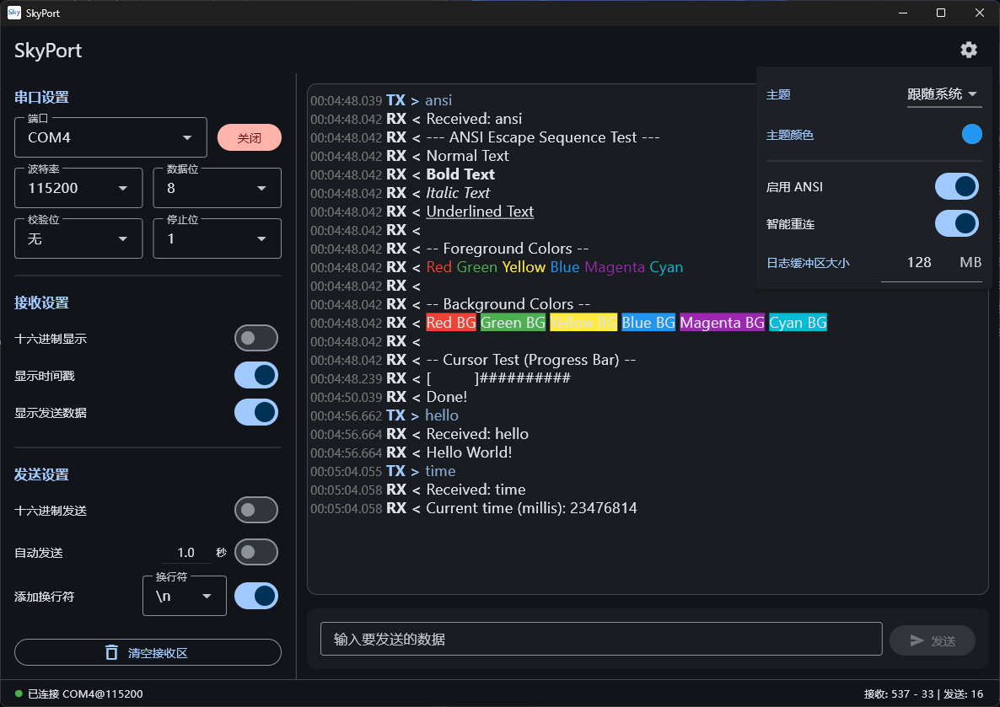

# SkyPort

[](https://github.com/StarSphere-1024/SkyPort/actions/workflows/release.yml)
[](https://www.gnu.org/licenses/agpl-3.0)

一款使用 Flutter 构建的跨平台串口调试助手，专注桌面平台的高性能串口收发与调试体验。

## 📸 界面预览



## ✨ 功能特性

*   **串口操作**
    *   自动扫描和列出可用串口。
    *   连接和断开串口设备，连接状态与收发统计显示在底部状态栏。
    *   可配置波特率、数据位、停止位和校验位，常用参数会被记忆并自动恢复。

*   **数据收发**
    *   支持 ASCII 和 Hex 两种格式发送和接收数据。
    *   支持“按块”和“按行”两种接收模式：
        *   按块模式：在短时间窗口内合并连续数据，适合二进制/高频数据流；
        *   按行模式：按换行符拆分，适合日志类文本输出。
    *   每条记录可选显示时间戳，并区分显示“发送”和“接收”记录。
    *   一键清空接收区。

*   **发送配置**
    *   支持 Hex 发送和文本发送模式切换。
    *   文本发送可选择是否自动追加换行，以及换行风格（LF / CR / CRLF）。

*   **界面与体验**
    *   基于 Material Design 3，左右双栏布局：左侧为配置与发送控制，右侧为数据日志与输入区。
    *   支持浅色/深色主题。
    *   窗口尺寸、位置和串口偏好会被记忆，提升日常使用效率。

*   **跨平台**
    *   当前支持 Windows 和 Linux 桌面平台（MacOS 与 Android 在规划中）。

## 📥 下载安装

你可以从 [GitHub Releases](https://github.com/StarSphere-1024/SkyPort/releases) 页面下载最新版本的安装包。

## 🚀 如何构建

### 环境准备
确保你已安装 Flutter SDK 和 Dart SDK。详情请参考 [Flutter 官方文档](https://flutter.dev/docs/get-started/install)。

### 构建步骤

1.  **克隆仓库**
    ```bash
    git clone https://github.com/StarSphere-1024/SkyPort.git
    cd SkyPort
    ```

2.  **获取依赖**
    ```bash
    flutter pub get
    ```

3.  **运行应用（桌面）**
    ```bash
    flutter run -d windows  # Windows
    flutter run -d linux    # Linux
    ```

4.  **构建发布版本**
    ```bash
    flutter build windows  # Windows
    flutter build linux    # Linux
    ```

## 📦 主要依赖

*   [flutter_riverpod](https://pub.dev/packages/flutter_riverpod): 用于状态管理。
*   [flutter_libserialport](https://pub.dev/packages/flutter_libserialport): 用于串口通信。
*   [shared_preferences](https://pub.dev/packages/shared_preferences): 用于记忆用户偏好和串口参数。
*   [window_manager](https://pub.dev/packages/window_manager): 用于桌面端窗口管理。

## 🤝 贡献

欢迎贡献！请遵循以下步骤：

1. Fork 本仓库
2. 创建你的特性分支 (`git checkout -b feature/AmazingFeature`)
3. 提交你的更改 (`git commit -m 'Add some AmazingFeature'`)
4. 推送到分支 (`git push origin feature/AmazingFeature`)
5. 开启一个 Pull Request

### 开发环境设置
- 安装 Flutter 3.0+
- 运行 `flutter pub get` 安装依赖
- 使用 `flutter run` 启动开发版本

## 🐛 问题报告

如果你发现 bug 或有功能建议，请在 [Issues](https://github.com/StarSphere-1024/SkyPort/issues) 页面提交。

## 📄 许可证

本项目采用 [GNU Affero General Public License v3.0](LICENSE) 许可证。

## 👤 作者

**StarSphere-1024** - [GitHub](https://github.com/StarSphere-1024)

---

*如果这个项目对你有帮助，请给它一个 ⭐！*

